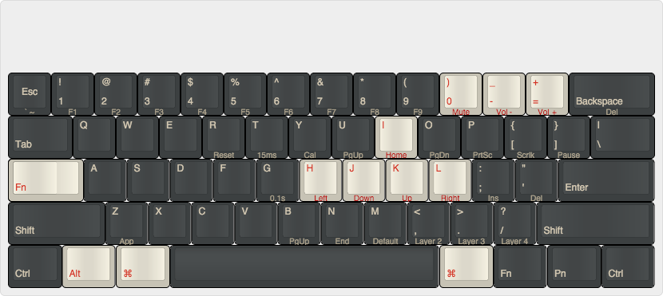

### pok3r layout
==============

Layer 2 Layout on [keyboard-layout-editor.com](http://www.keyboard-layout-editor.com/##@_name=Pok3r%20Layer%202&author=shawyu&switchMount=cherry&switchBrand=cherry&switchType=MX1A-C1xx%3B&@_y:1.5&c=%233c4041&t=%23aba18b&p=DCS&a:7%3B&=Esc%0A%0A%0A%0A%60%20~&_a:4%3B&=!%0A1%0A%0A%0AF1&=%2F@%0A2%0A%0A%0AF2&=%23%0A3%0A%0A%0AF3&=$%0A4%0A%0A%0AF4&=%25%0A5%0A%0A%0AF5&=%5E%0A6%0A%0A%0AF6&=%2F&%0A7%0A%0A%0AF7&=*%0A8%0A%0A%0AF8&=(%0A9%0A%0A%0AF9&_c=%23c7c3b5&t=%23ba1312%3B&=)%0A0%0A%0A%0AMute&=%2F_%0A-%0A%0A%0AVol%20-&=+%0A%2F=%0A%0A%0AVol%20+&_c=%233c4041&t=%23aba18b&w:2%3B&=%0ABackspace%0A%0A%0ADel%3B&@_w:1.5%3B&=%0ATab&=Q&=W&=E&=R%0A%0A%0A%0AReset&=T%0A%0A%0A%0A15ms&=Y%0A%0A%0A%0ACal&=U%0A%0A%0A%0APgUp&_c=%23c7c3b5&t=%23ba1312%3B&=I%0A%0A%0A%0AHome&_c=%233c4041&t=%23aba18b%3B&=O%0A%0A%0A%0APgDn&=P%0A%0A%0A%0APrtSc&=%7B%0A%5B%0A%0A%0AScrlk&=%7D%0A%5D%0A%0A%0APause&_w:1.5%3B&=%7C%0A%5C%3B&@_c=%23c7c3b5&t=%23ba1312&w:1.25&w2:1.75%3B&=%0AFn&_x:0.5&c=%233c4041&t=%23aba18b%3B&=A&=S&=D&=F&=G%0A%0A%0A%0A0.1s&_c=%23c7c3b5&t=%23ba1312%3B&=H%0A%0A%0A%0ALeft&=J%0A%0A%0A%0ADown&=K%0A%0A%0A%0AUp&=L%0A%0A%0A%0ARight&_c=%233c4041&t=%23aba18b%3B&=%2F:%0A%2F%3B%0A%0A%0AIns&=%22%0A'%0A%0A%0ADel&_w:2.25%3B&=%0AEnter%3B&@_w:2.25%3B&=%0AShift&=Z%0A%0A%0A%0AApp&=X&=C&=V&=B%0A%0A%0A%0APgUp&=N%0A%0A%0A%0AEnd&=M%0A%0A%0A%0ADefault&=%3C%0A,%0A%0A%0ALayer%202&=%3E%0A.%0A%0A%0ALayer%203&=%3F%0A%2F%2F%0A%0A%0ALayer%204&_w:2.75%3B&=%0AShift%3B&@_w:1.25%3B&=%0ACtrl&_c=%23c7c3b5&t=%23ba1312&w:1.25%3B&=%0AAlt&_w:1.25%3B&=%0A%E2%8C%98&_c=%233c4041&t=%23aba18b&p=DCS%20SPACE&a:7&w:6.25%3B&=&_p=DCS&a:4&w:1.25%3B&=%0AAlt&_w:1.25%3B&=%0AFn&_w:1.25%3B&=%0APn&_w:1.25%3B&=%0ACtrl)
